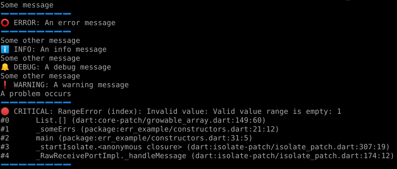
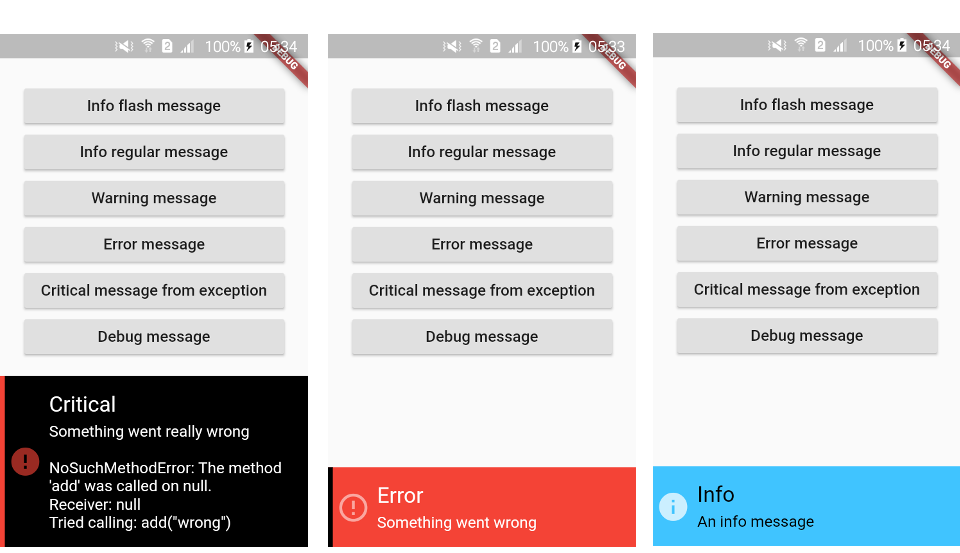

# Err router

A logs router that can pop messages to the device screen. 
Based on the [err](https://github.com/synw/err) package for errors management. The messages can be routed to:

- Terminal and on device console
- Flash messages
- Snackbar messages

## Usage

Initialize the logger

   ```dart
   import 'package:err_router/err_router.dart';

   final ErrRouter log = ErrRouter();
   ```

Create an error with the [Err](https://pub.dev/documentation/err/latest/err/Err-class.html) class and log it to console:

   ```dart
   final err = Err.error("Network error");
   log.console(err);
   ```

### Console messages



The `console` method prints an error and save it to history

#### Arguments

Accepted arguments: any object, string or an `Err` instance. Pass it an `Exception` or `Error` to get the stacktrace printed in the message

The `Err` class constructors all accept a `userMessage` parameter. Use it to separate the technical message for the developer from the user friendly message for the user:

   ```dart
   /// let's say we have an exception [e]
   final err = Err.error(e, userMessage: "Can not connect to x");
   log.scren(err, context);
   ```

The message displayed to user will be the one from `userMessage`

### Snackbar messages

   ```dart
   log.screen(err, context);
   ```



### Flash messages


   ```dart
   log.flash(err);
   ```

The flash messages are toast messages. They stay one second on the screen

### History

To access the history:

   ```dart
   final List<Err> history = log.history;
   ```

### On device console

Navigate to `DeviceConsolePage(log)` to see the console on the device

## Libraries used

- [Flutter toast](https://pub.dartlang.org/packages/fluttertoast)
- [Flushbar](https://pub.dartlang.org/packages/flushbar)
